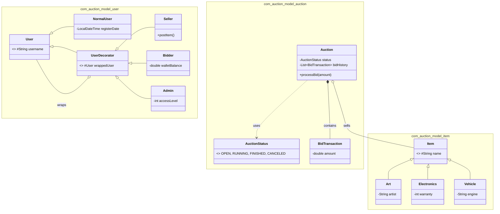

```mermaid
classDiagram
    %% Định nghĩa các Namespace/Package để nhóm các class
    namespace com_auction_model_user {
        class User { <<abstract>> #String username }
        class NormalUser { -LocalDateTime registerDate }
        class UserDecorator { <<abstract>> #User wrappedUser }
        class Seller { +postItem() }
        class Bidder { -double walletBalance }
        class Admin { -int accessLevel }
    }

    namespace com_auction_model_auction {
        class Auction {
            -AuctionStatus status
            -List~BidTransaction~ bidHistory
            +processBid(amount)
        }
        class AuctionStatus { <<enumeration>> OPEN, RUNNING, FINISHED, CANCELED }
        class BidTransaction { -double amount }
    }

    namespace com_auction_model_item {
        class Item { <<abstract>> #String name }
        class Art { -String artist }
        class Electronics { -int warranty }
        class Vehicle { -String engine }
    }

    %% Thiết lập quan hệ Kế thừa
    User <|-- NormalUser
    User <|-- UserDecorator
    UserDecorator <|-- Seller
    UserDecorator <|-- Bidder
    UserDecorator <|-- Admin
    
    Item <|-- Art
    Item <|-- Electronics
    Item <|-- Vehicle

    %% Thiết lập quan hệ Kết tập & Thành phần
    Auction *-- BidTransaction : contains
    Auction o-- Item : sells
    Auction ..> AuctionStatus : uses
    
    %% Quan hệ Decorator
    UserDecorator o-- User : wraps
```    